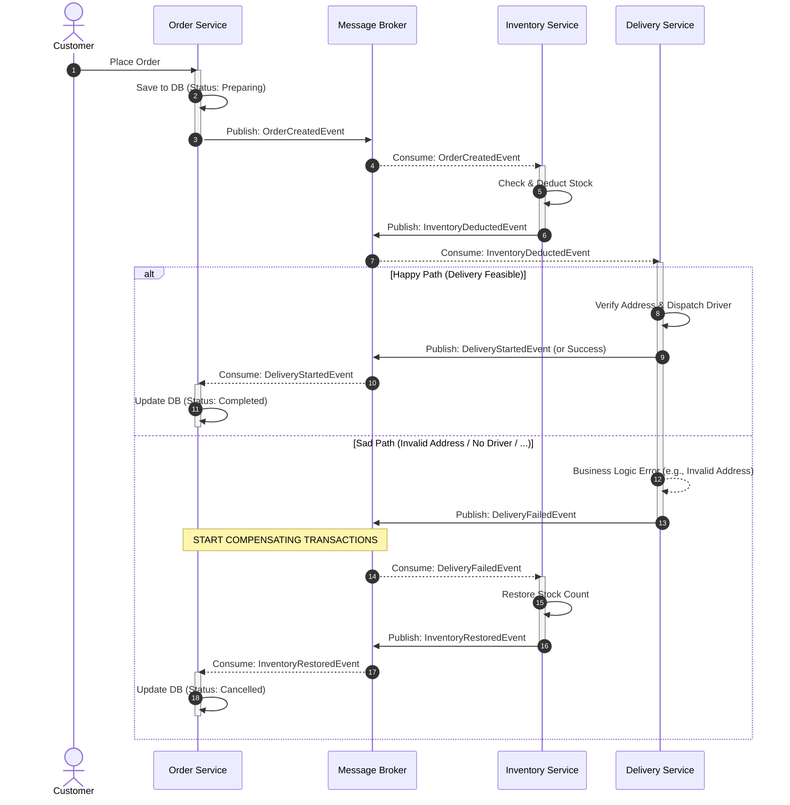

### About this project

## Overview
- Demonstrates how to implement the Saga pattern in .NET Core using the MassTransit library.
- Covers two types of sagas: Choreography and Orchestration, which resolve distributed transaction challenges in a microservices architecture.

## Versions
- **.NET Target Framework:** .NET 8.0
- **MassTransit:** Version 8.4.1

## Choreography sequence diagram




## How to run 
1. Clone this repository and navigate to the project directory:
```bash
git clone https://github.com/tritailk65/Sample.Saga.DotNet.git
cd Sample.Saga.Dotnet
```

2. Open the project with Visual Studio, Visual Studio Code, or your preferred IDE.

Start Docker Desktop (required for integration tests with a real database), then run:

```script
cd tests/Choreography.Integration.Tests
docker compose up -d
```

3. Build the project and run the tests:
```script
dotnet build
dotnet test
```


